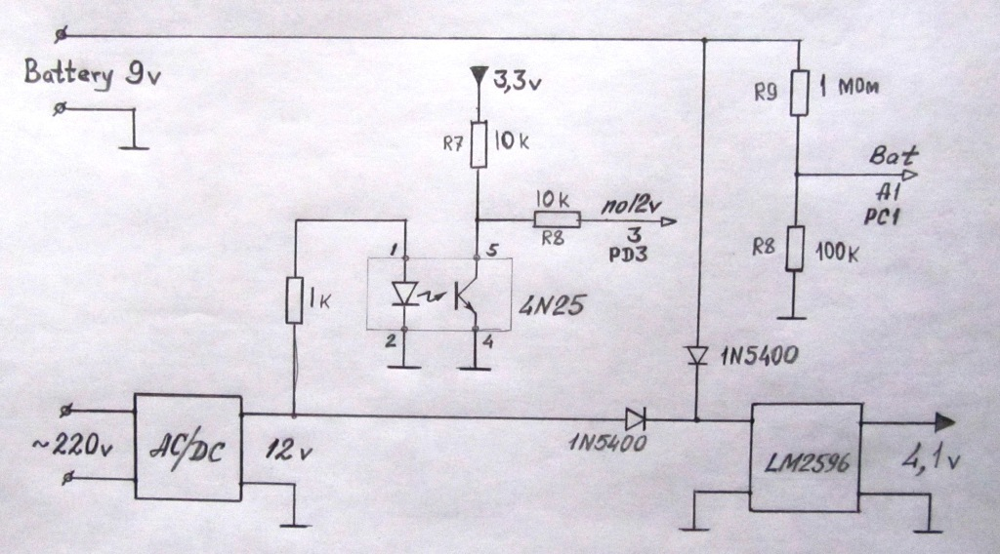
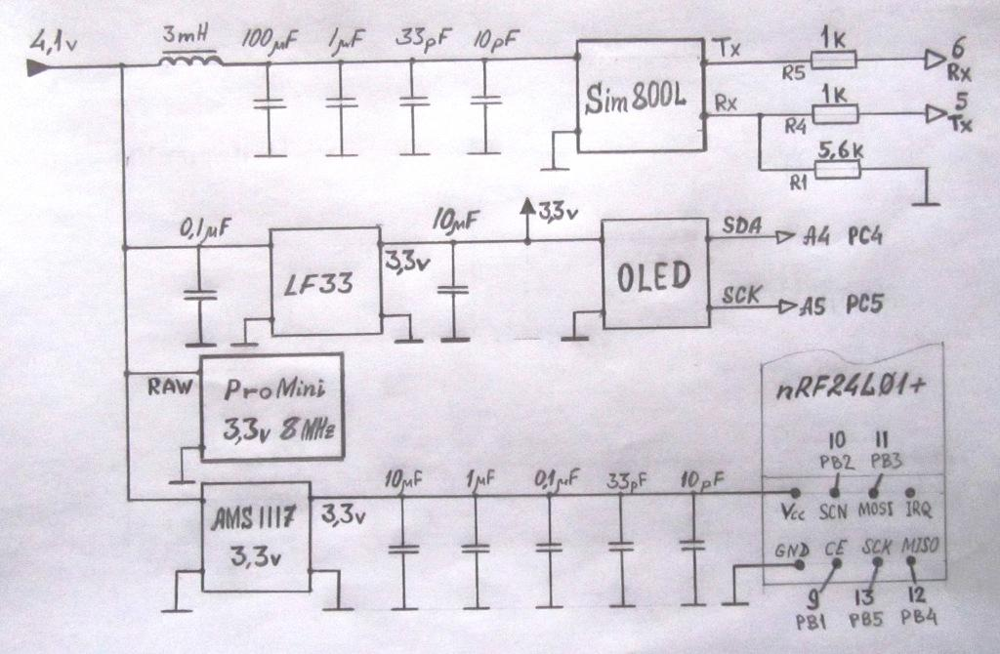

# SMS-термометр Журавли GRUS4

Задача: получать показания термометра дистанционно, посредством GSM модуля SIM800L.

## Схема электрическая принципиальная






## GSM модуль SIM800L


### SIM800L GSM Module Pinout

- `NET` is a pin where you can solder Helical Antenna provided along with the module.

- `VCC` supplies power for the module. This can be anywhere from 3.4V to 4.4 volts. An external power source like Li-Po battery or DC-DC buck converters rated 3.7V 2A would work.

- `RST` (Reset) is a hard reset pin. If you absolutely got the module in a bad space, pull this pin low for 100ms to perform a hard reset.

- `RxD` (Receiver) pin is used for serial communication.

- `TxD` (Transmitter) pin is used for serial communication.

- `GND` is the Ground Pin and needs to be connected to GND pin on the Arduino.

- `RING` pin acts as a Ring Indicator. It is basically the ‘interrupt’ out pin from the module. It is by default high and will pulse low for 120ms when a call is received. It can also be configured to pulse when an SMS is received.

- `DTR` pin activates/deactivates sleep mode. Pulling it HIGH will put module in sleep mode, disabling serial communication. Pulling it LOW will wake the module up.

- `MIC±` is a differential microphone input. The two microphone pins can be connected directly to these pins.

- `SPK±` is a differential speaker interface. The two pins of a speaker can be tied directly to these two pins.
 
### Электропитание

Диапазон электропитания SIM800L составляет от 3,4 В до 4,4 В. Рекомендуемое напряжение - 4,0 В. Источник питания должен обеспечивать ток до 2 А. Вход VBAT настоятельно рекомендуется шунтировать конденсатором с низким внутренним сопротивлением (low ESR, equivalent series resistance), например, 100 мкФ.

### Последовательный порт

Электрические характеристики последовательного порта модуля SIM800L:
```
Symbol  Min  Typ  Max  Unit 
VIL    -0.3   -   0.7   V 
VIH     2.1   -   3.1   V 
VOL      -    -   0.4   V 
VOH     2.4  2.8   -    V 
```

Электрические характеристики 3,3 вольтовой логики:
```
Symbol  Min  Max  Unit 
VIL     0.0  0.8   V 
VIH     2.0  3.3   V 
VOL     0.0  0.4   V 
VOH     2.4  3.3   V 
```

Рекомендуемое соединение между модулем DCE (SIM800L) и DTE (ProMini 3.3v 8MHz) с уровнем логики 3,3 В:


## Arduino ProMini 3.3v 8MHz


## nRF24L01+


